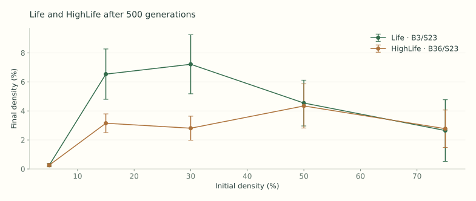
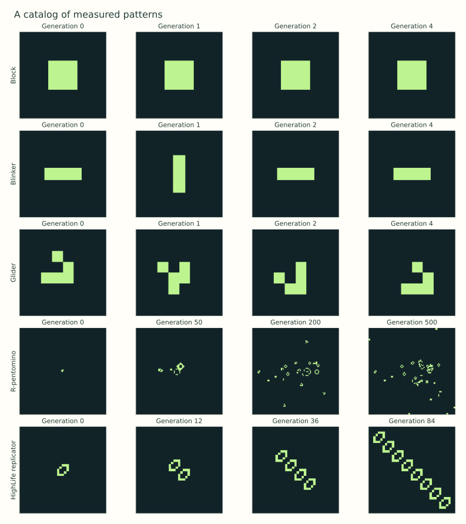
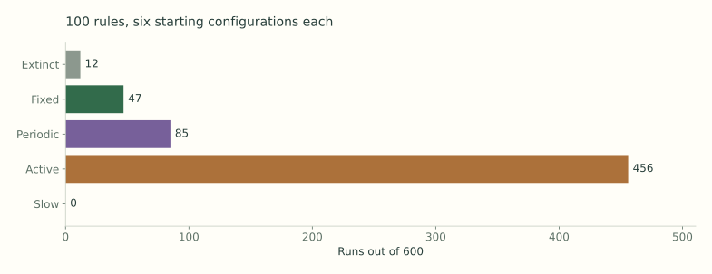
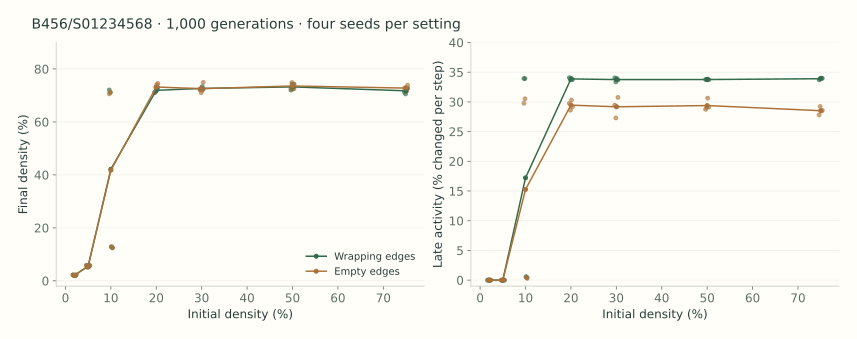
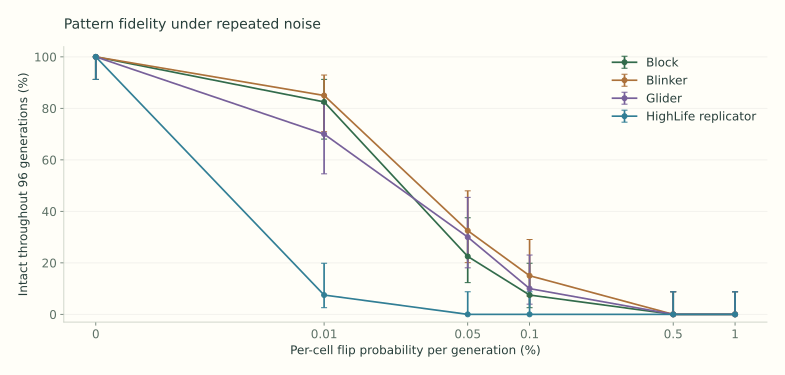

# Emergent Complexity: initial experimental report

Prepared with AI assistance for George Tsoukalas's initial assignment. This is a reproducible experimental record and a draft for Bob to review, rather than a claim of independent authorship or a completed personal reflection.

## Questions and scope

How much does changing a local birth or survival condition change the behavior of a whole world? How strongly do starting density and the exact arrangement of cells affect the outcome? How much repeated random disturbance can a recognizable pattern tolerate?

The project implements binary, two-dimensional, outer-totalistic cellular automata and the assignment's Option B, noise and perturbations. There are 1,990 recorded runs: 600 in the rule survey, 50 comparing Life and HighLife, 56 investigating one selected rule, 960 testing pattern fidelity under noise, and 324 testing noise in random worlds. The known-pattern catalog is additional.

The website has an interactive laboratory, a searchable 100-rule survey with six traces per rule, replay links, measured figures, this report, and downloadable raw data. It runs entirely in the browser. There is no model training, backend service, account requirement, or API key.

## What was built and how it works

A cell is either 0 (dead) or 1 (alive). It sees the eight cells around it, excluding itself. In B3/S23, a dead cell is born with exactly three living neighbors; a living cell survives with two or three. All other cells become or stay dead. HighLife adds birth at six neighbors: B36/S23. The nine birth choices and nine survival choices give 2^18 = 262,144 possible rules.

Each generation reads one Uint8Array and writes another, then swaps them. This makes the update simultaneous: a cell never sees a neighbor that has already been updated in the current generation. Neighbor indices are prepared once. The engine first computes three-cell horizontal sums, then combines the row above, the current row, and the row below and subtracts the center cell. An 18-entry lookup table applies the selected rule.

Wrapping boundaries join opposite edges, making a finite torus. Empty boundaries treat all cells outside the grid as dead. Edge cells inside the grid still update normally. Neither boundary implements an infinite plane. The interface supports both, and every recorded experiment identifies its boundary.

The lab supports drawing and erasing, keyboard editing, run/pause, single steps, reset, speed, seeded random starts, density and grid size, editable birth/survival counts, known patterns, and noise. Reset restores the starting grid and saved random state. Drawing or changing the rule, noise, or boundary starts a new trajectory at generation zero. A JSON snapshot preserves a current state for exact continuation, including the pseudorandom generator state. PNG export captures the displayed grid.

The browser, its survey worker, and the Node experiment script import the same engine. Randomness uses Mulberry32 with a deterministic string-to-integer hash. A seed is a label for a reproducible pseudorandom sequence, not a source of physical randomness. Initial-state randomness and noise use separate streams. The recorded study seeds are ASCII strings.

## Life and HighLife

Each rule was run from five random densities (5%, 15%, 30%, 50%, 75%) and five seeds, on 64 × 64 wrapping grids for 500 generations. The seeds are density-a through density-e. Initial grids are matched across the two rules. The same seed also couples the density settings, making them paired comparisons rather than independent samples at each density.

| Rule | Initial density | Mean final density (five seeds) |
| --- | --- | --- |
| B3/S23 | 5.00% | 0.26% |
| B3/S23 | 15.00% | 6.53% |
| B3/S23 | 30.00% | 7.21% |
| B3/S23 | 50.00% | 4.54% |
| B3/S23 | 75.00% | 2.65% |
| B36/S23 | 5.00% | 0.26% |
| B36/S23 | 15.00% | 3.15% |
| B36/S23 | 30.00% | 2.81% |
| B36/S23 | 50.00% | 4.34% |
| B36/S23 | 75.00% | 2.77% |



At a 30% start, the final mean living density was 7.21% for Life and 2.81% for HighLife. More permissive birth does not necessarily leave more cells alive after many generations: extra births change the subsequent neighbor counts and interactions. This is an interpretation of these paired finite runs, not a theorem about the two rules.

The pattern catalog separates several behaviors. A block stays unchanged. A blinker returns after two steps. A glider returns to the same shape displaced one cell diagonally after four steps. The R-pentomino provides a compact seed with a long transient, with frames recorded at 0, 50, 200, and 500. The HighLife replicator gives two translated copies after twelve steps; later recorded frames show the growth of the replicating arrangement. Pattern frames use 96 × 96 empty-boundary grids. The R-pentomino experiment is finite and may be affected by those boundaries; it is not a claim about its final fate on an infinite plane.



The HighLife seed was transcribed from David Eppstein's published RLE example. Its twelve-step two-copy result is verified against explicitly constructed expected copies in the test suite. This demonstrates replication of this particular seed. Random activity in a different rule does not automatically demonstrate replication, heredity, adaptation, or natural selection.

## The 100-rule survey

Sample seed: george-rule-survey-v1. Sampling draws uniform integers from 0 to 262143 and rejects duplicates. The low nine bits encode birth at neighbor counts 0 through 8; the high nine encode survival. Rules with B0 and rules that look uninteresting are retained.

Each of the 100 rules uses six initial configurations: densities 10%, 30%, and 50%, each with seeds soup-a and soup-b. Grids are 48 × 48, edges wrap, noise is zero, and every run lasts 300 generations. A rule's six starts are identical to the corresponding starts in every other rule.

The measurements are population, density, the number of cells changed per generation, and exact full-grid recurrence. Late activity is the mean fraction of cells changed over the final 60 updates. A packed binary string represents each grid without a hash collision risk. When a noiseless grid recurs, determinism guarantees a cycle on that finite grid.

Classification uses the following priority:

- Extinct: an empty grid was reached and B0 is absent, so it remains empty without noise.
- Fixed: the exact grid repeats after one generation, excluding absorbing extinction.
- Periodic: the exact grid repeats after more than one generation.
- Active: no full-grid repeat was found, and late activity is at least 2%.
- Slow: no full-grid repeat was found, with late activity below 2%.

A separate growth flag marks a fitted density increase greater than 0.0005 per generation over the tail window. This is a finite-window trend, not unbounded growth. B0 rules can leave an empty state, so an empty frame in such a rule is not labeled absorbing extinction. The classification does not automatically detect moving objects, local oscillators inside an active background, self-replication, or mathematical chaos. Those properties require more targeted analysis. No new replicator was established in the random survey.

| Run classification | Count out of 600 |
| --- | --- |
| extinct | 12 |
| fixed | 47 |
| periodic | 85 |
| active | 456 |
| slow | 0 |



Most sampled starts remained active within this window. That does not imply most rules support interesting computation: a rule can be active without persistent, useful structure. Labels attach to individual starts, not to the entire rule. All 100 rules and their six outcomes are visible on the experiments page, with population traces and links to replay generation zero or the recorded final generation.

## A closer look at B456/S01234568

Rule number 84 in the sampled order (encoded integer 196208) was selected by a stated exploratory score: among rules without B0, maximize four times the number of observed outcome categories, plus the range of final densities, plus one if settled and active/slow outcomes coexist. Ties use sampling order. This favors contrasting outcomes, not novelty or a formal complexity measure. It is a post-survey selection, so subsequent observations are exploratory.

In the original survey, both 10% starts became fixed. The four 30% and 50% starts remained active, with mean late activity about 34%. Birth needs four, five, or six neighbors, while survival includes zero. A plausible explanation is that sparse arrangements can preserve isolated cells without producing many births, while sufficiently populated neighborhoods continue interacting. Establishing a causal mechanism would require controlled seed interventions.

The follow-up uses 64 × 64 grids, 1,000 generations, densities 2%, 5%, 10%, 20%, 30%, 50%, 75%, four new seeds (detail-a through detail-d), and both boundaries. At 2% and 5%, all sixteen starts became fixed. At 20% and above, all thirty-two starts remained active. At 10%, the exact starting arrangement mattered:

| Boundary | Seed | Outcome | Exact period | Final density | Late activity |
| --- | --- | --- | --- | --- | --- |
| wrap | detail-a | active | No repeat found | 72.09% | 33.93% |
| wrap | detail-b | active | No repeat found | 71.09% | 33.92% |
| wrap | detail-c | periodic | 120 | 12.87% | 0.60% |
| wrap | detail-d | periodic | 8 | 12.48% | 0.44% |
| fixed | detail-a | active | No repeat found | 70.61% | 29.78% |
| fixed | detail-b | active | No repeat found | 71.19% | 30.53% |
| fixed | detail-c | periodic | 30 | 12.82% | 0.46% |
| fixed | detail-d | periodic | 8 | 12.40% | 0.29% |



For detail-c at a 10% start, the wrapping world had period 120 and the empty-boundary world had period 30. The same density is therefore insufficient to predict the final pattern. The boundary can also alter a global recurrence period. These are confirmed finite-grid cycles, not newly discovered oscillator constructions on an infinite plane. The mixed outcomes near 10% suggest a more focused density-and-seed study; the present sample does not locate a critical density or establish a phase transition.

## Option B: repeated noise

After the deterministic update, each cell independently flips 0 to 1 or 1 to 0 with probability p. Noise can both add and remove cells. It is applied everywhere, including empty background cells. The six rates are 0, 0.0001, 0.0005, 0.001, 0.005, and 0.01. For example, p = 0.0001 means 0.01% per cell per generation, or about 0.41 flips per generation across a 64 × 64 grid.

First, four centered patterns are compared with their exact noise-free trajectories: block, blinker, glider, and HighLife replicator. Each setting has 40 seeds, named pattern:noise:0 through pattern:noise:39. Each run lasts 96 generations on a 64 × 64 empty-boundary grid. The reference patterns fit within these grids during the measured window. The baseline is computed once per pattern.

At each generation, the fidelity mask includes every living cell of the reference pattern and all of its immediate neighbors. The noisy and reference states must agree at all masked locations. Empty gaps far from the pattern are excluded. Intact-throughout means no mismatch occurred at any of the 96 checked generations. Final-match asks only about generation 96, allowing earlier disruption followed by recovery. This is strict agreement with a particular position and phase; a shifted or otherwise recognizable surviving copy may fail the test.

| Per-cell flip probability | Block intact | Blinker intact | Glider intact | Replicator intact |
| --- | --- | --- | --- | --- |
| 0.00% | 40/40 | 40/40 | 40/40 | 40/40 |
| 0.01% | 33/40 | 34/40 | 28/40 | 3/40 |
| 0.05% | 9/40 | 13/40 | 12/40 | 0/40 |
| 0.10% | 3/40 | 6/40 | 4/40 | 0/40 |
| 0.50% | 0/40 | 0/40 | 0/40 | 0/40 |
| 1.00% | 0/40 | 0/40 | 0/40 | 0/40 |



At p = 0.0001, 33/40 block runs, 34/40 blinker runs, 28/40 glider runs, and 3/40 replicator runs remained intact throughout. At p = 0.001, the counts were 3, 6, 4, and 0. No tested pattern remained intact throughout at 0.5% or 1% noise in these trials. This locates a practical loss of strict fidelity for this duration and metric; it is not a universal noise threshold.

The replicator exposes substantially more structure. Its total checked cell-generations are 19155, compared with 1536 for the block. Its lower fidelity therefore cannot be attributed solely to an intrinsically weaker local mechanism. Pattern size, lifetime, motion, and the growing target all matter. The intervals are 95% Wilson binomial intervals within each setting. Zero-noise repetitions are identical controls, and common random-number streams couple different rates; they are not independent evidence across settings.

Second, noise is added to matched random worlds for Life, HighLife, and the selected rule. This uses 48 × 48 wrapping grids, 300 generations, the survey's six initial configurations, three noise seeds per configuration, and the same six rates: 324 recorded runs. Final Hamming distance is the fraction of cells differing from the same initial world's noise-free final state.

| Rule | Flip probability | Mean late activity | Mean final Hamming distance |
| --- | --- | --- | --- |
| B3/S23 | 0.00% | 3.84% | 0.00% |
| B3/S23 | 0.01% | 4.72% | 11.38% |
| B3/S23 | 1.00% | 12.95% | 18.04% |
| B36/S23 | 0.00% | 5.58% | 0.00% |
| B36/S23 | 0.01% | 3.58% | 10.08% |
| B36/S23 | 1.00% | 19.17% | 23.79% |
| B456/S01234568 | 0.00% | 22.49% | 0.00% |
| B456/S01234568 | 0.01% | 29.30% | 43.22% |
| B456/S01234568 | 1.00% | 34.44% | 49.27% |

These aggregates average the six starts and three noise streams. The zero-noise repetitions are duplicates of deterministic controls. Changed-cell activity includes both the rule's effects and injected noise; a busy grid is not automatically a robust computation. The selected rule's trajectories diverged substantially at low noise, while the HighLife mean late activity at the smallest nonzero rate was lower than its control mean. The relationship is not uniformly monotone in this finite sample.

## Reproduction and validation

Use Node.js 22 or later. The browser app and experiments have no runtime package dependencies.

```text
npm start
npm test
npm run experiment
npm run report
npm run check
```

The server opens at http://127.0.0.1:4173. The experiment command regenerates all JSON and CSV measurements in dist/data. The report command regenerates the Markdown and HTML text from those measurements. To recreate the standalone scientific figures, install requirements-report.txt with Python and run python scripts/figures.py. Matplotlib and NumPy are needed only for figure generation; the website ships with the generated SVGs and PNGs.

The manifest records study configurations and seeds. Raw population, changed-cell, and injected-flip counts are retained for every generation of the survey, density, detail, and random-world noise studies. Pattern-noise data retain each trial's first mismatch, final match, final population, and final Hamming distance, plus the intact-throughout survival curve for every setting. A blank firstMismatch in the CSV means no failure was observed through generation 96, not failure at generation zero.

The engine is checked against an independent direct eight-neighbor implementation over random rules, rectangular grids, both boundary types, and multiple generations. Other tests verify blocks, blinkers, glider displacement, exact HighLife replication, B0 behavior, noise timing, reproducible sampling, malformed snapshot rejection, and saved noisy continuation. Dataset checks recompute selected recorded trajectories and verify counts and classifications. Static checks verify script syntax, page entry points, and local links. General browser click and visual QA is not claimed by these checks.

## Limitations and a next research question

The study samples only 100 of 262,144 rules and a small number of initial grids. Finite boundaries, finite observation windows, the uniform rule prior, and the exploratory selection criterion all shape the results. A lack of recurrence within 300 or 1,000 steps does not prove non-periodicity: every deterministic finite-state world eventually recurs. Activity and population are useful descriptors, not measures of computational universality or open-ended complexity.

The fidelity metric deliberately asks a narrow question. It does not count surviving translated copies under noise, identify mutations that are inherited, or test differential reproductive success. Persistent patterns and replication are relevant ingredients for artificial-life questions, but these experiments do not establish Darwinian evolution.

A proposed next question is: can the mixed outcomes near 10% density in B456/S01234568 be predicted from local motifs, rather than just global density? One approach is to collect many new seeds, measure candidate activating neighborhoods, and intervene by adding or removing those neighborhoods in paired starts. A second direction is to measure noisy replicator copy counts while normalizing for exposed cell-generations. Both would turn a visual observation into a more specific causal experiment. Neither is claimed to be novel without a literature review.

## AI use and personal reflection

Codex implemented the simulator, selected Option B, designed and ran the recorded experiments, wrote the tests, generated the figures, and drafted this report. The checks provide evidence for particular behaviors; they do not replace Bob's responsibility to understand the code and review the design choices before presenting the work as his own.

The assignment also asks for a personal response to the introductory video, what felt exciting, and what to learn next. Those personal answers have not been supplied by Bob and are not invented here. The video's transcript was unavailable during this build, so this report does not claim a completed viewing or invent a viewing reflection. The proposed research questions above are discussion material for Bob to evaluate after watching and using the lab.

## Sources and data

- George Tsoukalas, Emergent Complexity: Initial Assignment, supplied PDF dated September 2026.
- [Introductory slides supplied by George](https://docs.google.com/presentation/d/1gsOaxcF1HxZjXxVJ6rrsMIikBtcoJwq_3MrEeSp8XI4/edit).
- [Emergent Garden, Artificial Life, assigned introductory video](https://www.youtube.com/watch?v=2g-CrQfYNtE).
- [David Eppstein, Lifelike Rules and Pattern Notation](https://ics.uci.edu/~eppstein/ca/lifelike.html), source of the rule notation and HighLife replicator seed.
- [Raw run summaries (CSV)](./dist/data/runs.csv), [pattern-noise trials (CSV)](./dist/data/pattern-noise.csv), [full survey (JSON)](./dist/data/survey.json), [experiment manifest (JSON)](./dist/data/manifest.json).
